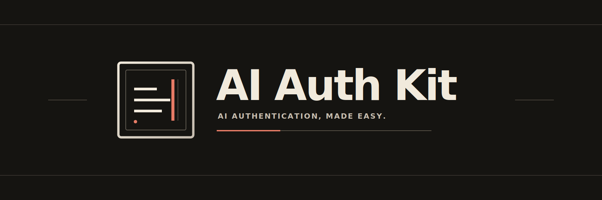

# AI Auth Kit

**AI authentication, made easy.**

## Install

Pending: use this exact command after npm package @abran-labs/ai-auth-kit@1.0.0 is published.

```sh
bun add @abran-labs/ai-auth-kit@1.0.0
```

## Install the skill

The optional, version-matched agent skill gives coding agents the library's implementation
guidance without adding runtime code.

Pending: use this exact command after the agent-skill-v1.0.0 release asset is uploaded.

```sh
curl -fsSL https://github.com/abran-labs/ai-auth-kit/releases/download/agent-skill-v1.0.0/install-agent-skill.sh | sh
```

_On narrow screens, scroll command blocks horizontally._

## Providers

| Provider | Available choices |
| --- | --- |
| OpenAI | API key, `OPENAI_API_KEY`, or built-in account OAuth |
| GitHub Copilot | `GITHUB_TOKEN`, `GH_TOKEN`, or `COPILOT_GITHUB_TOKEN`, plus built-in account OAuth |
| Anthropic | API key, `ANTHROPIC_API_KEY`, or optional CLIProxyAPI account auth |
| Google | API key, supported Gemini/Google environment variables, or optional CLIProxyAPI account auth |
| Other catalog providers | API key or environment auth only when source environment names exist |
| Ollama compatibility entry | No auth, or environment auth via `OLLAMA_API_KEY`; no API-key method |

Optional [CLIProxyAPI](https://github.com/router-for-me/CLIProxyAPI) account auth applies only to
Anthropic and Google. API keys and environment variables do not require it.

## Why AI Auth Kit

Provider auth usually means rebuilding API-key, environment, OAuth, and model-selection flows for
every tool. AI Auth Kit puts reviewed provider policy behind one TypeScript library while the host
keeps control of its commands, prompts, output, and provider calls.

## Links

- [Docs](https://abran-labs.github.io/ai-auth-kit/)
- [Source](https://github.com/abran-labs/ai-auth-kit)
- [Quickstart](https://abran-labs.github.io/ai-auth-kit/start/quickstart/)
- [Providers and authentication](https://abran-labs.github.io/ai-auth-kit/guides/providers-auth/)
- [Agent skill](https://abran-labs.github.io/ai-auth-kit/guides/agent-skill/)
- [API reference](https://abran-labs.github.io/ai-auth-kit/reference/api/)

MIT licensed.
